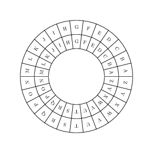

# Ceaser's Cipher
- In this project, our aim is to design and implement a robust encryption and decryption system. Our program will offer the functionality to encode text using a secure encryption algorithm, rendering the original content unreadable to anyone without the proper decryption key. The encryption process will involve converting the input text into a format that is indecipherable without the corresponding decryption method.

To ensure the security of the encoded data, we will employ industry-standard encryption techniques, making it virtually impossible for unauthorized parties to access the original content. Additionally, our system will provide users with a seamless decryption experience, allowing them to easily retrieve the original text from the encoded form using the decryption key.

One of the key features of our program is its user-friendly interface, which will enable users to interact with the encryption and decryption functions intuitively. We will prioritize usability, aiming to make the process of encrypting and decrypting text as straightforward as possible for our users.

Furthermore, our program will be designed with flexibility in mind, allowing users to customize certain aspects of the encryption process to suit their specific needs. This could include options such as choosing the encryption algorithm or providing a custom decryption key for added security.

In summary, our project will deliver a comprehensive encryption and decryption solution that prioritizes security, usability, and flexibility. Users can expect a reliable and efficient tool for securing their sensitive information with confidence."

